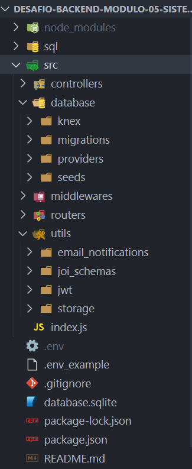

# Desafio Módulo 5 do curso de Desenvolvimento de Software com foco em backend da Cubos Academy.

Descrição do desafio:

Criar uma API para um PDV (Frente de Caixa). 

Esse será um projeto piloto, ou seja, no futuro outras funcionalidades serão implementadas.


## 🚀 Começando

Essas instruções permitirão que você obtenha uma cópia do projeto em operação na sua máquina local para fins de desenvolvimento e testes.

### 📋 Pré-requisitos

Antes de executar este projeto no seu computador, você precisará de alguns pacotes instalados como:

```
Node.js - Para executar os códigos Javascript fora do navegador;
Express - Pacote do Node.js para subir um servidor http localmente;
Bcrypt - Para criar as hashs das senhas dos usuários;
jsonwebtoken - Pacote usado para gerenciar o login do usuário via token;
Joi - Validar corpo da requisição, além de parâmetros de consulta e de url;
pg - Biblioteca PostgreSQL (usado quando estiver em deploy);
sqlite3 - Biblioteca usada para gerar banco de dados leve (para uso local)
dotenv - Para configurar as variáveis de ambiente;
Insomnia ou Postman - Para testar a API com requisições via GET, POST, PUT e DELETE.
```

### 🔧 Instalação


Para executar o projeto no seu ambiente de desenvolvimento em execução, primeiramente faça o clone desse repositório em sua maquina local na pasta desejada:

```

git clone https://github.com/flavioms86/desafio-backend-modulo-05-sistema-pdv-b2b-ifood-t08.git
```

Depois abra o projeto em seu editor de códigos, abra o terminal e digite o seguinte comando para a instalação dos pacotes e dependências necessárias:

```
npm install
```

Após a instalação, verificar as variáveis de ambiente devem ser configuradas. Para uso na máquina local, as seguintes variáveis devem ser configuradas:

```
PORT= (porta na qual o node estará ouvindo).
NODE_ENV= (aqui define qual será o ambiente de execução do node, para uso na maquina local, especifique "development", na nuvem, em deploy, especifique "production".
IS_LOCALHOST= (true para execução local e false em deploy).
JWT_SECRET= (senha para o jwt, pode ser uma senha qualquer no formato string).
JWT_EXPIRES_IN= (tempo de expiração do token, deve ser no formato 8h para 8 horas, por exemplo).
EMAIL_HOST= (host do provedor de email).
EMAIL_PORT= (porta de conexão).
EMAIL_USER= (usuário).
EMAIL_PASS= (senha).
EMAIL_NAME= (nome do remetente do email).
EMAIL_FROM= (email do remetente).
```


Para iniciar o servidor, basta executar o nodemon (para não precisar restartar o servidor depois de alguma alteração):

```
npm run dev
```

Ou pelo node:

```
npm run start
```

O servidor estará executando localmente e aceitando requisições na porta 3000:

```
localhost:3000
```

## ⚙️ Estrutura do projeto



## **Endpoints**


<summary><b>Listar categorias</b></summary>

#### `GET` `/categoria`

Essa é a rota que será chamada quando o usuário quiser listar todas as categorias cadastradas.

As categorias a seguir precisam ser previamente cadastradas para que sejam listadas no endpoint de listagem das categorias.

## **Categorias**

-   Informática
-   Celulares
-   Beleza e Perfumaria
-   Mercado
-   Livros e Papelaria
-   Brinquedos
-   Moda
-   Bebê
-   Games

</details>

<details>
<summary><b>Cadastrar usuário</b></summary>

#### `POST` `/usuario`

Essa é a rota que será utilizada para cadastrar um novo usuário no sistema.

Critérios de aceite:

    - Validar os campos obrigatórios: 
        - nome
        - email
        - senha
    - A senha deve ser criptografada utilizando algum algoritmo de criptografia confiável.
    - O campo e-mail no banco de dados deve ser único para cada registro, não permitindo dois usuários possuírem o mesmo e-mail.

</details>

<details>
<summary><b>Efetuar login do usuário</b></summary>

#### `POST` `/login`

Essa é a rota que permite o usuário cadastrado realizar o login no sistema.

Critérios de aceite:

    - Validar se o e-mail e a senha estão corretos para o usuário em questão.
    - Gerar um token de autenticação para o usuário.

</details>

---

## **ATENÇÃO**: Todas as funcionalidades (endpoints) a seguir, a partir desse ponto, deverão exigir o token de autenticação do usuário logado, recebendo no header com o formato Bearer Token. Portanto, em cada funcionalidade será necessário validar o token informado.

---

<details>
<summary><b>Detalhar perfil do usuário logado</b></summary>

#### `GET` `/usuario`

Essa é a rota que permite o usuário logado a visualizar os dados do seu próprio perfil, de acordo com a validação do token de autenticação.

</details>

<details>
<summary><b>Editar perfil do usuário logado</b></summary>

#### `PUT` `/usuario`

Essa é a rota que permite o usuário logado atualizar informações de seu próprio cadastro, de acordo com a validação do token de autenticação.

Critérios de aceite:

    - Validar os campos obrigatórios: 
        - nome
        - email
        - senha
    - A senha deve ser criptografada utilizando algum algoritmo de criptografia confiável.
    - O campo e-mail no banco de dados deve ser único para cada registro, não permitindo dois usuários possuírem o mesmo e-mail.

</details>

<details>
<summary><b>Efetuar deploy da aplicação</b></summary>
<br>

Fazer deploy do projeto e disponibilizar a URL.

</details>

</details>

---


## Aulas úteis:

-   [Revisão pt1](https://aulas.cubos.academy/turma/1e4b0f04-1795-4b02-a19f-83e221b2ba4e/aulas/e4e0b794-91a2-42a3-9a03-137c20fcb350)
-   [Revisão pt2](https://aulas.cubos.academy/turma/1e4b0f04-1795-4b02-a19f-83e221b2ba4e/aulas/0648b3e8-55cb-4bf8-b425-00e9b213fd00)
-   [Git e fluxo de trabalho em equipe](https://aulas.cubos.academy/turma/1e4b0f04-1795-4b02-a19f-83e221b2ba4e/aulas/cd27aa06-f5d2-4448-9cac-48b563f6117d)
-   [Deploy](https://aulas.cubos.academy/turma/1e4b0f04-1795-4b02-a19f-83e221b2ba4e/aulas/f3cb34a7-8e87-4ea1-830e-ef089f851aa6)
-   [Envio de e-mails](https://aulas.cubos.academy/turma/1e4b0f04-1795-4b02-a19f-83e221b2ba4e/aulas/f5d73a28-cce3-429c-9488-51b453f20e37)
-   [Validações e boas práticas](https://aulas.cubos.academy/turma/1e4b0f04-1795-4b02-a19f-83e221b2ba4e/aulas/150b1f0b-735f-413b-870f-864ecae8a8bc)
-   [Upload de arquivos](https://aulas.cubos.academy/turma/1e4b0f04-1795-4b02-a19f-83e221b2ba4e/aulas/ad6993d5-c47d-4971-a86f-c7e41a93b6cd)


###### tags: `back-end` `módulo 5` `nodeJS` `PostgreSQL` `API REST` `desafio`
